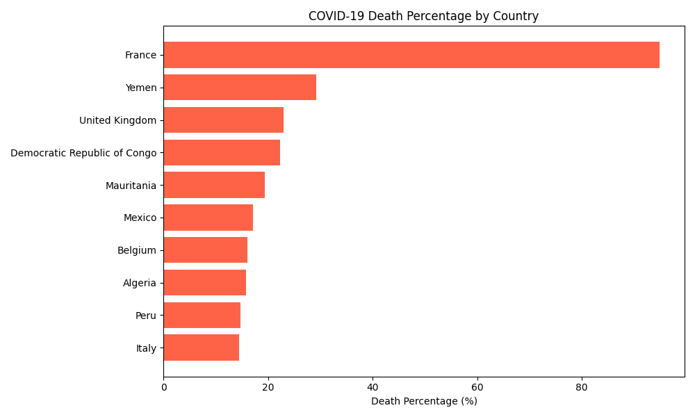
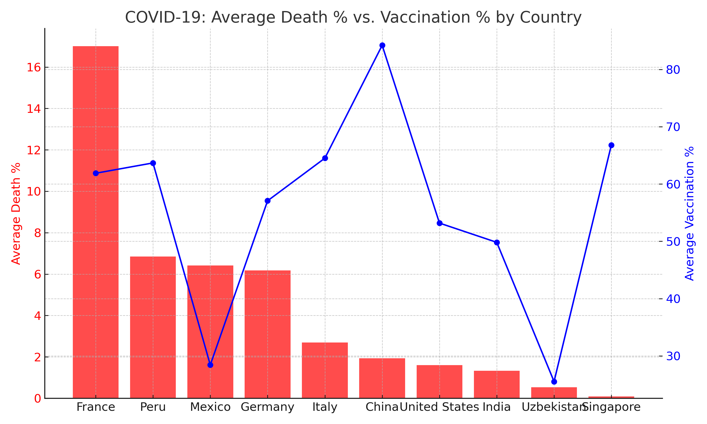

# 🦠 COVID-19 PostgreSQL Analysis  

  

PostgreSQL-based analysis of **COVID-19 deaths** and **vaccination trends**.  

# 🦠 COVID-19 Data Analysis (PostgreSQL)
## 📌 Project Overview

This project provides a PostgreSQL-based analytical workflow for exploring the relationship between COVID-19 deaths and vaccination progress.
It integrates global COVID-19 datasets into a single view and applies SQL queries to analyze death percentages, vaccination rates, and correlation patterns.

## 🎯 Objectives

- Create a combined view of COVID-19 deaths and vaccination data. 

- Calculate death percentage and full vaccination rate.

- Track death percentage trends by country over time.

- Identify Top 10 countries with the highest death percentages.

- Compare average death percentage vs. vaccination rate by country.

- Compute Pearson correlation between vaccination rates and death percentages.

## ⚙️ Technologies Used

- PostgreSQL (queries, views, correlation analysis)

- COVID-19 dataset (deaths & vaccinations)

- SQL functions: ROUND(), NULLIF(), ROW_NUMBER(), AVG(), corr()

# 📊 Key SQL Components
## 1. Create Combined View

Merges deaths and vaccinations data by country and date.
```sql
CREATE OR REPLACE VIEW covid_combined AS
SELECT 
    d.country,
    d.date,
    d.total_cases,
    d.total_deaths,
    ROUND((d.total_deaths::numeric * 100) / NULLIF(d.total_cases, 0)::numeric, 2) AS death_percentage,
    v.people_fully_vaccinated,
    ROUND((v.people_fully_vaccinated::numeric * 100) / NULLIF(v.population, 0)::numeric, 2) AS full_vaccination_rate
FROM covid_deaths d
JOIN covid_vaccinations v
    ON d.country = v.country AND d.date = v.date;
```

## 2. Death Percentage Trend

Tracks how death percentages evolve over time for each country.
```sql
SELECT country, date, total_cases, total_deaths, death_percentage
FROM covid_combined
ORDER BY country, date;
```
## 3. Top 10 Countries with Highest Death %

Filtered (cases > 1000) and ranked by maximum death percentage.
```sql
SELECT country, date, total_cases, total_deaths, death_percentage
FROM (
  SELECT country, date, total_cases, total_deaths,
         ROUND((total_deaths::numeric * 100.0) / NULLIF(total_cases, 0), 2) AS death_percentage,
         ROW_NUMBER() OVER (PARTITION BY country ORDER BY (total_deaths::numeric * 100.0) / NULLIF(total_cases, 0) DESC) AS rn
  FROM covid_combined
  WHERE total_cases > 1000
    AND total_deaths <= total_cases
) sub
WHERE rn = 1
ORDER BY death_percentage DESC
LIMIT 10;
```
## 📌 Results (Top 10 countries):


## 4. Aggregated Analysis

Compare average death % and vaccination rate by country (only those with >20% avg. vaccination).
```sql
SELECT 
    country,
    ROUND(AVG(death_percentage), 2) AS avg_death,
    ROUND(AVG(full_vaccination_rate), 2) AS avg_vaccinated
FROM covid_combined
GROUP BY country
HAVING AVG(full_vaccination_rate) > 20
ORDER BY avg_death DESC;
```
## 📌 Sample Results:


## 5. Correlation Analysis

Measures the relationship between vaccination and death percentage.
```sql
SELECT corr(death_percentage, full_vaccination_rate) AS correlation_coef
FROM covid_combined
WHERE total_cases > 1000;
```

## 📌 Result:

- Correlation Coefficient: -0.39

## 📈 Insights & Findings

- France shows an unusually high 94.95% death rate on 2020-07-07, likely due to reporting anomalies (deaths recorded before all cases confirmed).

- Yemen, Congo, Mauritania highlight how fragile healthcare systems and late testing inflated early death percentages.

- Western Europe (Italy, Belgium, UK) experienced high mortality during the early wave before vaccination campaigns scaled up.

### Aggregated Analysis:

- Despite high vaccination rates, some countries (e.g., France, Peru) show higher average death % → this suggests timing of outbreaks and healthcare overload mattered as much as vaccines.

- Countries like China, Singapore, UAE achieved high vaccination rates (>65%) and maintained very low death percentages (<2%).

- Uzbekistan maintained a relatively low death % (0.53%), though vaccination rollout lagged compared to global leaders.

- Correlation (-0.39):

- Confirms a moderate negative relationship between vaccination rates and death percentages.

- Vaccination did not eliminate deaths but significantly reduced the severity and fatality rates globally.

## 🚀 How to Use

1. **Load the Data**  
   - Download and extract `Data/Data.zip`.  
   - Import `covid_deaths.csv` and `covid_vaccinations.csv` into PostgreSQL.  

2. **Run the SQL Script**  
   - Execute the `covid_analysis.sql` file in PostgreSQL.  
   - This will create the necessary views and queries for analysis.  

3. **Explore the Insights**  
   Use the provided queries to analyze:  
   - 📈 **Trends over time** – COVID-19 cases, deaths, and vaccinations over time  
   - 🌍 **Country comparisons** – compare countries and regions  
   - 🔗 **Correlation patterns** – relationships between vaccination rates and death rates  

## ✅ Conclusion

This project demonstrates how SQL and PostgreSQL analytical functions can uncover real-world health insights.
The findings emphasize that while data inconsistencies exist, the overall global trend proves vaccination reduced death rates.
